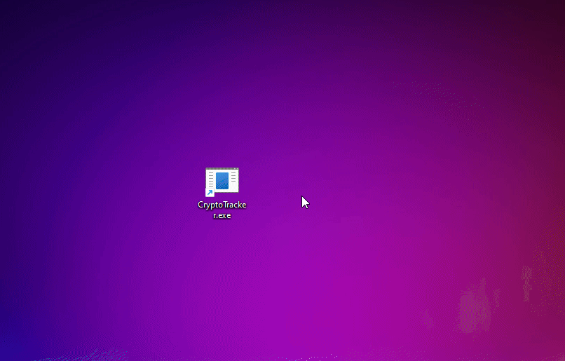

## CryptoTracker (test assignment)

Приложение для мониторинга курсов криптовалютных пар на платформах Binance, Bitget, Bybit и Kucoin.



### Технические детали

Проект разделен на 2 части: UI и Core.

**UI** это конкретная реализация графического интерфейса.<br>
В качестве требования было использование WinForms. С этим фреймворком я взаимодействовал впервые (да и вообще с графическими интерфейсами в целом), и выглядит оно ужасно. Тем не менее свои задачи оно выполняет. 
А именно:
- Вывод котировок криптовалюты на разных биржах, с периодичностью в 5 секунд
- Возможность получать котировки через веб-сокет
- Возможность выбирать пару из выпадающего списка

**Core** содержит функционал который можно переиспользовать для разных оберток, таких как WebUI, DesktopUI, ConsoleUI, и тд.

Основное взаимодействие происходит через класс **TickerServiceFactory** который создает необходимую реализацию интерфейса **ITickerService**.
В требованиях указывалось на необходимость унифицировать используемые внешние API (Binance, Bitget, Bybit, Kucoin) под единый интерфейс, чем и является вышеупомянутый **ITickerService**:

```cs
var factory = new TickerServiceFactory();

ITickerService binance = factory.Create(ExchangeName.Binance);
ITickerService kucoin = factory.Create(ExchangeName.Kucoin);
// и тд...

var result = await binance.SubscribeToTickerUpdatesAsync(TradingPair.BTC_USDT, ticker =>
{
  Console.WriteLine($"""
    Exchange: {ticker.Exchange}
    Pair:     {ticker.Pair}
    Price:    {ticker.LastPrice}
    Low:      {ticker.LowPrice24H}
    High:     {ticker.HighPrice24H}
    Change:   {ticker.ChangePercentage24H}
    """);
});

if (!result.GetResultOrError(out var subscription, out var error))
{
  Console.WriteLine($"Failed to connect: {error.Message}");
  return;
}

await Task.Delay(3000);
await subscription.CloseAsync();
```

**TickerServiceFactory** можно использовать двумя способами:
1. создавать экземпляр напрямую (как показано в примере выше)
2. регистрировать в DI и внедрять интерфейс **ITickerServiceFactory**:
```cs
var builder = WebApplication.CreateBuilder(args);

builder.Services.AddTickerServiceFactory();

var app = builder.Build();

app.MapGet(
  "/api/{exchange}/{pair}",
  async (ExchangeName exchange, TradingPair pair, ITickerServiceFactory factory, CancellationToken ct) =>
{
  var service = factory.Create(exchange);

  var result = await service.GetTickerAsync(pair, ct);
  if (!result.GetResultOrError(out var ticker, out var error))
  {
    // handle error
  }

  return Results.Ok(ticker);
});

app.Run();
```

> [!NOTE]
> В случае с **Kucoin**, [Web-Socket клиент](https://www.kucoin.com/docs/websocket/spot-trading/public-channels/ticker) не предоставляет такие данные как **LowPrice24h**, **HighPrice24h** и **ChangePercentage24h**. Поэтому, в получаемом объекте [TickerData](https://github.com/schmidt-x/CryptoTracker/blob/main/src/Core/Entities/TickerData.cs) эти свойства всегда содержат значения **-1**, **-1** и **0**.
